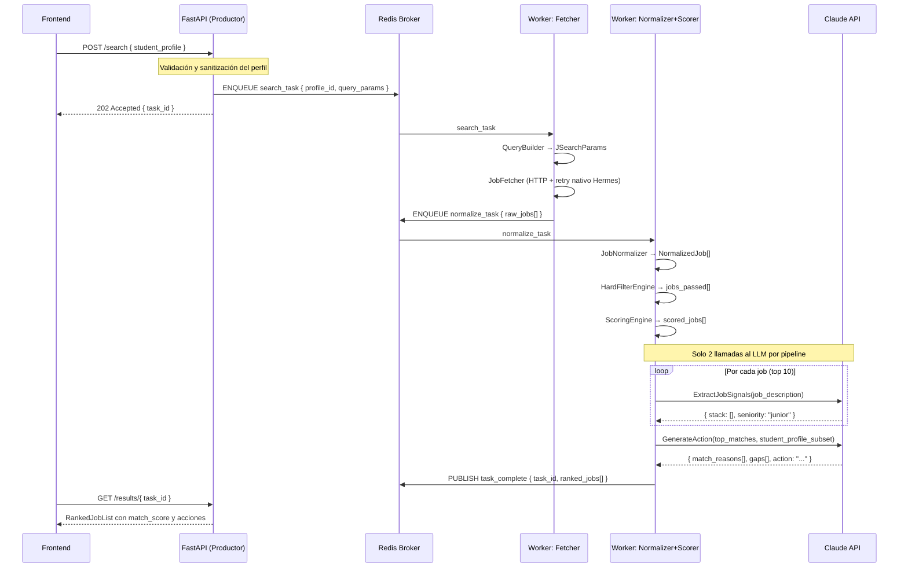

# ADR-001: Capa de Orquestación del Agente JobSearcher

**Fecha:** 2026-05-25  
**Estado:** Aceptado  
**Autor:** Equipo Lyfter  
**Contexto:** Subtarea 3 — Decisión técnica de orquestación

---

## Contexto

El agente JobSearcher recibe un `StudentProfile`, busca ofertas de empleo, aplica filtros y scoring, y devuelve una lista rankeada con acciones concretas para el estudiante. Debemos decidir en qué capa de orquestación corre este agente.

El flujo es conocido y relativamente determinístico:

```
StudentProfile → QueryBuilder → JobFetcher (JSearch) → Normalizer
    → HardFilter → ScoringEngine → RankedJobList → ActionGenerator
```

Solo dos pasos requieren razonamiento LLM real:
1. **Extracción de stack/seniority** del texto libre del job description
2. **Generación de la acción** personalizada (qué preparar, qué mencionar en el CV)

El resto del pipeline es lógica de negocio determinística.

---

## Criterios de Comparación

| Criterio | Descripción | Peso |
|----------|-------------|------|
| **Manejo de tools** | ¿Cómo se definen y ejecutan llamadas a herramientas (JSearch API)? | Alto |
| **Estado / memoria** | ¿Puede mantener contexto entre pasos del pipeline? | Medio |
| **Logs y trazabilidad** | ¿Se puede debuggear una sesión completa fácilmente? | Alto |
| **Autorización** | ¿Cómo se gestiona el acceso a APIs externas y datos de estudiantes? | Alto |
| **Retries / resiliencia** | ¿Qué pasa si JSearch falla o la API está caída? | Medio |
| **Despliegue** | ¿Qué infraestructura requiere? ¿Cómo se escala? | Alto |
| **Mantenimiento** | ¿Qué tan difícil es cambiar el flujo o actualizar dependencias? | Alto |
| **Costo operativo** | ¿Cuánto cuesta correr el agente por estudiante / por mes? | Medio |

---

## Opciones Evaluadas

### Opción A — OpenClaw

**Perfil:** Plataforma de orquestación multi-agente, orientada a flujos complejos con múltiples agentes que se coordinan. Diseñada para casos donde distintos agentes necesitan decidir dinámicamente qué herramienta invocar y cuándo.

| Criterio | Evaluación |
|----------|-----------|
| **Manejo de tools** | Declarativo, con routing automático entre herramientas según el agente activo |
| **Estado** | Estado compartido entre agentes, persistido en store propio |
| **Logs** | Panel de trazabilidad integrado; verboso por defecto |
| **Autorización** | Autorizaciones por agente/herramienta configurables en plataforma |
| **Retries** | Configurables por tool con backoff exponencial |
| **Despliegue** | Requiere correr la plataforma OpenClaw (servidor propio o cloud) |
| **Mantenimiento** | Curva de aprendizaje alta; cambios de flujo implican reconfigurar el grafo de agentes |
| **Costo** | Overhead de infraestructura + licencia/hosting de la plataforma |

**Fortaleza:** Ideal para sistemas donde múltiples agentes especializados colaboran y toman decisiones no determinísticas sobre qué hacer a continuación.

**Debilidad crítica para este caso:** El flujo de JobSearcher es un pipeline lineal, no un grafo de decisión multi-agente. OpenClaw introduce complejidad estructural que no aporta valor aquí — el overhead de mantener la plataforma supera los beneficios.

---

### Opción B — Hermes `[RECOMENDADA]`

**Perfil:** Capa de mensajería y orquestación de tareas basada en eventos. Diseñada para flujos asíncronos donde las tareas se encolan, se distribuyen a workers y se monitorean. Más cerca de un job queue con capacidades de workflow.

| Criterio | Evaluación |
|----------|-----------|
| **Manejo de tools** | Tools = workers o handlers suscritos a eventos; más flexible que OpenClaw para integrar APIs externas |
| **Estado** | Estado por mensaje/tarea; no mantiene contexto conversacional nativo |
| **Logs** | Trazabilidad por evento; requiere instrumentación adicional para correlacionar pasos del pipeline |
| **Autorización** | Las credenciales de APIs externas viven en los workers — correcto para aislamiento |
| **Retries** | Retry nativo por tarea con dead-letter queue |
| **Despliegue** | Requiere broker de mensajes (Redis, RabbitMQ) + workers; infra separada del backend HTTP |
| **Mantenimiento** | El flujo se expresa como handlers independientes — modular y desacoplado |
| **Costo** | Costo de infraestructura del broker; sin costo de plataforma propia |

**Fortaleza:** Permite ejecutar el pipeline en segundo plano (async), procesar múltiples estudiantes en paralelo, y desacoplar completamente el ingreso de solicitudes del procesamiento. Cada paso del pipeline (QueryBuilder, JobFetcher, Normalizer, Scorer) puede convertirse en un handler independiente, facilitando retries granulares y monitoreo por etapa.

**Consideración de despliegue:** Requiere un broker de mensajes (Redis recomendado por simplicidad operativa). El overhead inicial se justifica por la capacidad de escalar horizontalmente sin cambios en la lógica de negocio.

---

### Opción C — Claude API (Anthropic SDK) + Backend Tradicional

**Perfil:** Llamadas directas al API de Claude para los pasos que requieren razonamiento LLM; el resto del pipeline es código Python puro en un backend HTTP (FastAPI). Sin frameworks de orquestación de terceros.

| Criterio | Evaluación |
|----------|-----------|
| **Manejo de tools** | `tool_use` nativo del API de Claude — se definen como JSON schemas, Claude decide cuándo invocarlas |
| **Estado** | El historial de mensajes se pasa explícitamente al API; el estado del pipeline vive en variables locales |
| **Logs** | Log estándar de Python + trazas del API de Claude; fácil de instrumentar con structlog o logging |
| **Autorización** | API keys en variables de entorno; el backend actúa como guardia — el LLM nunca ve las credenciales |
| **Retries** | `tenacity` + HTTP client con backoff — 5 líneas de código, sin plataforma |
| **Despliegue** | FastAPI en cualquier servidor (Railway, Fly.io, AWS Lambda); sin infraestructura adicional |
| **Mantenimiento** | El flujo es código Python explícito — legible, testeable, iterable sin aprender un DSL |
| **Costo** | Solo tokens de Claude + costo del servidor; sin overhead de plataforma |

**Fortaleza:** Mínima superficie de riesgo, máxima legibilidad. El pipeline es código explícito — cualquier ingeniero puede seguirlo sin conocer un framework de orquestación.

**Limitación:** El procesamiento es sincrónico — un estudiante bloquea el hilo mientras JSearch responde. No escala a múltiples estudiantes concurrentes sin refactoring significativo.

---

## Análisis Comparativo

| Criterio | OpenClaw | Hermes | Claude API + FastAPI |
|----------|----------|--------|---------------------|
| **Manejo de tools** | ⭐⭐⭐⭐ | ⭐⭐⭐⭐ | ⭐⭐⭐⭐⭐ |
| **Estado / memoria** | ⭐⭐⭐⭐⭐ | ⭐⭐⭐⭐ | ⭐⭐⭐ |
| **Logs / trazabilidad** | ⭐⭐⭐⭐ | ⭐⭐⭐⭐ | ⭐⭐⭐⭐ |
| **Autorización** | ⭐⭐⭐⭐ | ⭐⭐⭐⭐⭐ | ⭐⭐⭐⭐⭐ |
| **Retries** | ⭐⭐⭐⭐⭐ | ⭐⭐⭐⭐⭐ | ⭐⭐⭐ |
| **Despliegue (simplicidad)** | ⭐⭐ | ⭐⭐⭐ | ⭐⭐⭐⭐⭐ |
| **Mantenimiento** | ⭐⭐ | ⭐⭐⭐⭐ | ⭐⭐⭐⭐⭐ |
| **Costo operativo** | ⭐⭐ | ⭐⭐⭐ | ⭐⭐⭐⭐⭐ |
| **Escalabilidad** | ⭐⭐⭐ | ⭐⭐⭐⭐⭐ | ⭐⭐⭐ |
| **Procesamiento concurrente** | ⭐⭐⭐ | ⭐⭐⭐⭐⭐ | ⭐⭐ |

---

## Qué Vive en el Agente vs. el Backend Tradicional

El error más común en sistemas LLM es hacer que el agente haga *demasiado*. La regla es: **el LLM solo debe razonar; el backend debe ejecutar**.

```
┌─────────────────────────────────────────────────────────────┐
│                    BACKEND TRADICIONAL                       │
│  (Python puro, determinístico, testeable con unit tests)     │
│                                                              │
│  • QueryBuilder: perfil → parámetros de búsqueda            │
│  • JobFetcher: llamada HTTP a JSearch / SerpAPI              │
│  • JobNormalizer: unificar schema de la API                  │
│  • HardFilterEngine: restricciones binarias                  │
│  • ScoringEngine: rúbrica numérica                           │
│  • Cache de búsquedas (24h por query)                        │
│                                                              │
└─────────────────────┬───────────────────────────────────────┘
                      │  Solo 2 llamadas al LLM por pipeline
┌─────────────────────▼───────────────────────────────────────┐
│                  AGENTE (Claude API)                         │
│  (Razonamiento no determinístico, caro, lento)               │
│                                                              │
│  • ExtractJobSignals: stack + seniority de texto libre       │
│  • GenerateAction: acción personalizada por match            │
│                                                              │
└─────────────────────────────────────────────────────────────┘
```

**Regla de oro:** Si se puede hacer con `if/else` o una regex, no involucrar al LLM.

---

## Riesgos de Ejecutar Búsquedas y Acciones Externas

### Riesgo 1 — El LLM construye queries directamente (EVITAR)

**Problema:** Si el agente construye y ejecuta el query a JSearch por sí mismo (sin pasar por el backend), puede inyectar parámetros inesperados, hacer más llamadas de las necesarias, o ignorar los rate limits.

**Mitigación:** El `QueryBuilder` vive en el backend y solo expone parámetros validados al agente como input, nunca como output. El agente *recibe* los datos, no *decide* cómo buscarlos.

### Riesgo 2 — Scraping desde el agente

**Problema:** Si el agente tiene acceso a una herramienta de scraping web genérica (`browse_web`, `fetch_url`), puede usarla de manera no controlada: visitar URLs inesperadas, ignorar ToS, consumir datos personales sin consentimiento.

**Mitigación:** No exponer herramientas de scraping genéricas al agente. El `JobFetcher` llama a APIs contractuales (JSearch, SerpAPI) — el agente solo recibe el JSON normalizado.

### Riesgo 3 — Fuga de datos del estudiante al LLM

**Problema:** El `StudentProfile` contiene datos personales (nombre, ciudad, salario esperado). Enviar todo el perfil raw al LLM expone datos innecesarios.

**Mitigación:** El backend extrae solo los campos relevantes para cada paso antes de pasarlos al LLM. Por ejemplo, para `ExtractJobSignals` solo se necesita el `job_description`, no el perfil del estudiante.

### Riesgo 4 — Acciones externas no autorizadas

**Problema:** Si el agente tiene tools para "aplicar a un trabajo" o "enviar un email", podría ejecutarlas en un loop sin confirmación del estudiante.

**Mitigación (para fases futuras):** Toda acción que afecte un sistema externo (enviar CV, contactar empresa) debe pasar por un paso de confirmación explícita del estudiante — nunca ejecutarse automáticamente. En la Subtarea 5 (Generación de Acciones) esto debe diseñarse como `human-in-the-loop`.

---

## Decisión Final

**Opción B — Hermes (orquestación por eventos + colas async)**

**Por qué:**
1. El pipeline de JobSearcher tiene pasos claramente delimitados (QueryBuilder → Fetcher → Normalizer → Scorer → Delivery) — cada uno puede convertirse en un handler de Hermes con responsabilidad única.
2. Hermes permite procesar múltiples estudiantes en paralelo sin cambios en la lógica de negocio: cada solicitud se encola y los workers la consumen de forma independiente.
3. El retry nativo por tarea con dead-letter queue elimina código de resiliencia manual — `tenacity` no es necesario en el `JobFetcher`.
4. Las credenciales de APIs externas (JSearch, SerpAPI) viven exclusivamente en los workers, nunca expuestas al frontend ni al LLM.
5. El desacople entre productor (FastAPI recibe la solicitud) y consumidor (workers procesan el pipeline) permite escalar los workers de forma independiente sin tocar la API HTTP.

**Infraestructura requerida:** Redis como broker (recomendado por simplicidad; RabbitMQ como alternativa si se requiere routing más complejo).

**Condición de revisión:** Si el sistema se reduce a un script de línea de comandos para uso individual (1 estudiante a la vez, sin concurrencia), el overhead de Hermes no se justifica y se recomienda volver a Opción C.

---

## Diagrama del Flujo Elegido



---

## Próximos Pasos

1. ✅ Decisión documentada en este ADR
2. Implementar `QueryBuilder` como función pura (input: `StudentProfile`, output: `JSearchParams`)
3. Implementar `JobNormalizer` (input: respuesta cruda JSearch, output: `NormalizedJob[]`)
4. Implementar `HardFilterEngine` y `ScoringEngine` según [match-rubric.md](../specs/match-rubric.md)
5. Implementar `ExtractJobSignals` con `tool_use` del Claude API
6. Ver flujo mínimo de prueba en [orchestration-minimal-flow/](../spikes/orchestration-minimal-flow/)
